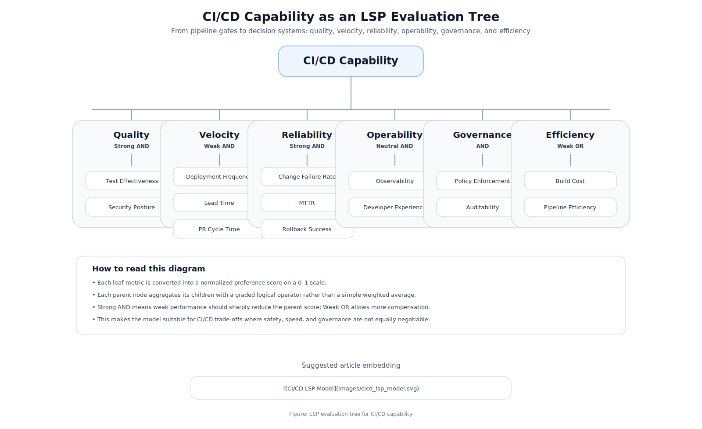

# From Pipeline Gates to Decision Systems: Applying LSP to DevOps

Modern CI/CD pipelines are incredibly powerful.

They build, test, scan, and deploy software automatically. They enforce rules. They prevent obvious failures.

But they still make decisions like this:

```
if tests_pass and security_pass:
    deploy
```

This is **binary thinking**.

Real engineering decisions are not binary.

---

## The Problem with Pipeline Gates

Consider a deployment:

- Test coverage: 82%
- One medium security vulnerability
- Deployment frequency: high
- Lead time: low

Should you deploy?

Most pipelines force this into a **yes/no decision**, but engineers don't think that way. We think in trade-offs:

- "The vulnerability is low risk"
- "Coverage is good enough"
- "We need to ship quickly"

We are already making **graded decisions** — just not explicitly.

---

## What DORA Metrics Give Us

The DORA metrics are a great starting point:

- Deployment Frequency
- Lead Time for Changes
- Change Failure Rate
- Mean Time to Restore

They tell us:

> *How are we performing?*

But they don't tell us:

> *Should we deploy right now?*

We need a way to **combine signals into decisions**.

---

## Enter Logic Scoring of Preference (LSP)

Logic Scoring of Preference (LSP), developed by Jozo Dujmovic, is part of a broader class of decision models used in engineering to evaluate complex systems with multiple criteria [1].
Instead of binary logic, LSP uses **graded logic**, allowing evaluators to control how much compensation is permitted between criteria [2].

As Dujmovic describes it, LSP enables the use of "continuous preference logic" to model real-world decision making where strict Boolean logic is insufficient [2].

---

## Moving Beyond Boolean Logic

In traditional logic:

- AND → everything must pass
- OR → anything can pass

In LSP, these become a **spectrum**:

```
MIN  ← AND ← average → OR → MAX
```

This spectrum reflects what Dujmovic formalized as graded conjunction–disjunction operators, enabling a continuous transition between logical AND and OR [2].

This allows you to express real-world reasoning:

- "Security is mandatory"
- "Speed is flexible"
- "Tests and coverage both matter"

---

## The Core Idea: Preferences

Each metric is converted into a score between 0 and 1.

| Metric | Value | Preference |
|-------|------|-----------|
| Test Coverage | 82% | 0.82 |
| Failure Rate | 10% | 0.7 |
| MTTR | 1 hour | 0.75 |

These are called **elementary preferences**.

---

## Aggregating with Graded Logic

Instead of a weighted average, LSP uses a generalized function:

```
Score = ( Σ wi * xi^r )^(1/r)
```

Where:

- `xi` = preference score
- `wi` = weight
- `r` = logical strictness

Interpretation:

- `r < 1` → AND-like (strict)
- `r = 1` → average
- `r > 1` → OR-like (flexible)

This lets you control **how much trade-off is allowed**.

---

## A CI/CD Model Beyond DORA


*Figure: LSP evaluation tree for CI/CD capability*

This structure represents an LSP evaluation tree, where each node aggregates its children using graded logical operators (e.g., strong conjunction for Quality and Reliability, weaker operators for Velocity and Efficiency).

---

### Quality

- Test effectiveness
- Security posture

> Strong AND — both must be high

---

### Velocity

- Deployment frequency
- Lead time

> Weak AND — trade-offs allowed

---

### Reliability

- Change failure rate
- Mean time to restore

> Strong AND — safety is critical

---

### Operability

- Observability
- Developer experience

---

### Governance

- Policy enforcement
- Auditability

---

### Efficiency

- Build cost
- Pipeline efficiency

> Weak OR — optimization, not blocking

---

## Why Weighted Averages Fail

A weighted average allows **perfect compensation**:

- terrible security + great speed = acceptable score

This is wrong in practice.

Dujmovic's work highlights this limitation explicitly: traditional aggregation methods allow full compensation, while many engineering decisions require non-compensatory behavior [1].

LSP lets you say:

> "Security is non-negotiable."

---

## Example Evaluation

Input:

| Metric | Score |
|-------|------|
| Deploy Frequency | 0.9 |
| Lead Time | 0.8 |
| Failure Rate | 0.5 |
| MTTR | 0.7 |

Result:

```
Velocity: 0.85
Reliability: 0.60
Overall: 0.72
```

Interpretation:

> We move fast, but we are not safe.

---

## From Gates to Decision Systems

Traditional pipeline:

```
pass → deploy
fail → stop
```

LSP-based pipeline:

```
score = evaluate()

if score > threshold:
    deploy
```

This enables:

- risk-aware deployments
- continuous evaluation
- better prioritization

---

## Alignment with Systems Engineering

In aerospace and large-scale engineering, systems are evaluated using multi-criteria models.

See the NASA Systems Engineering Handbook.

These systems:

- evaluate multiple dimensions
- prevent unsafe trade-offs
- model real-world constraints

CI/CD systems are no different.

---

## Implementation Path

You don't need to boil the ocean.

Start small:

1. Pick 4 metrics (e.g., DORA)
2. Define preference functions
3. Choose operators (strict vs flexible)
4. Compute a score in your pipeline
5. Iterate

---

## Final Thought

We've spent years automating delivery.

The next step is to make our systems **reason about delivery**.

> CI/CD pipelines shouldn't just enforce rules.  
> They should help us make better decisions.

---

## References

- [1] Jozo Dujmovic, "A Method for Evaluation and Selection of Complex Hardware and Software Systems," 22nd International Conference for the Resource Management and Performance Evaluation of Enterprise Computing Systems, 1996.
- [2] Jozo Dujmovic, "Continuous Preference Logic for System Evaluation," IEEE Transactions on Fuzzy Systems, 2007.
- [3] NASA Systems Engineering Handbook, NASA/SP-2007-6105 Rev2.
- [4] DORA DevOps Research and Assessment, "Accelerate: The Science of Lean Software and DevOps," 2018.
